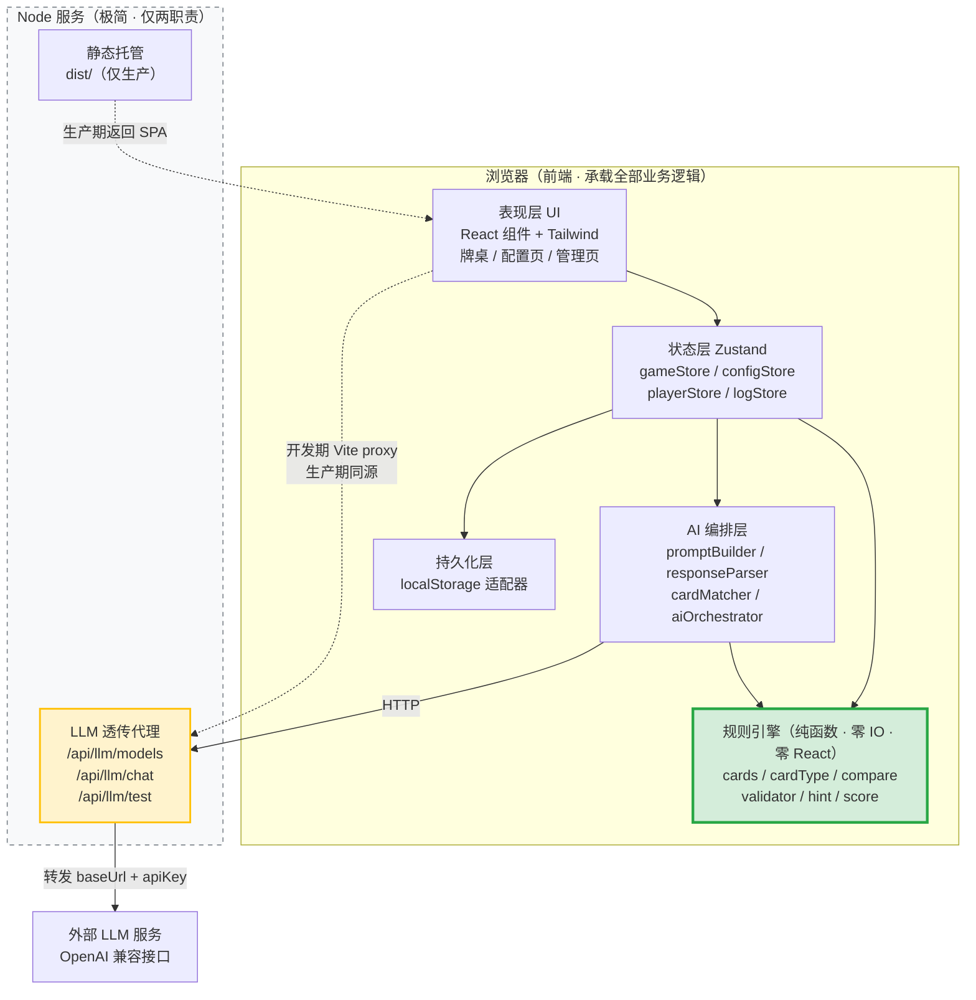
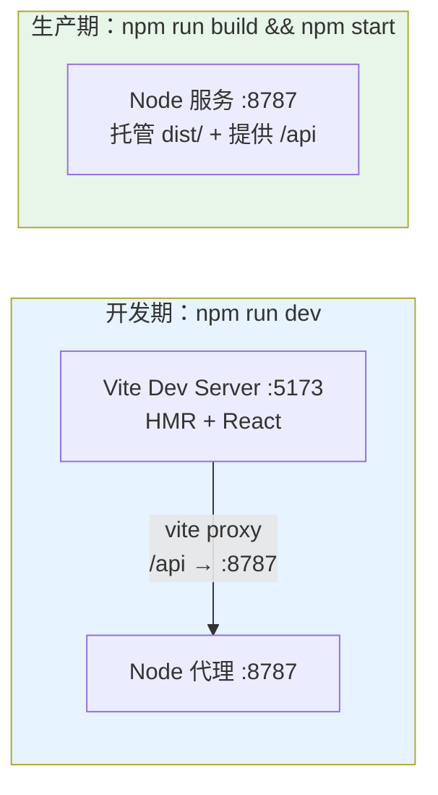
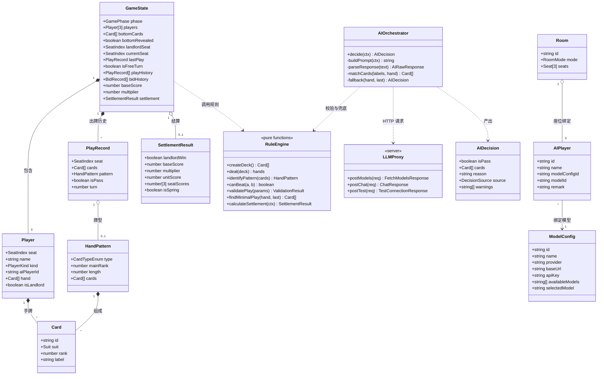
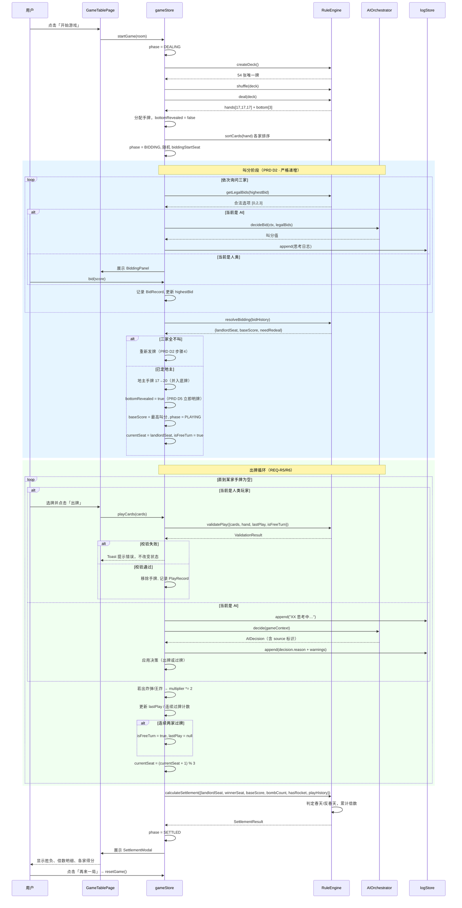
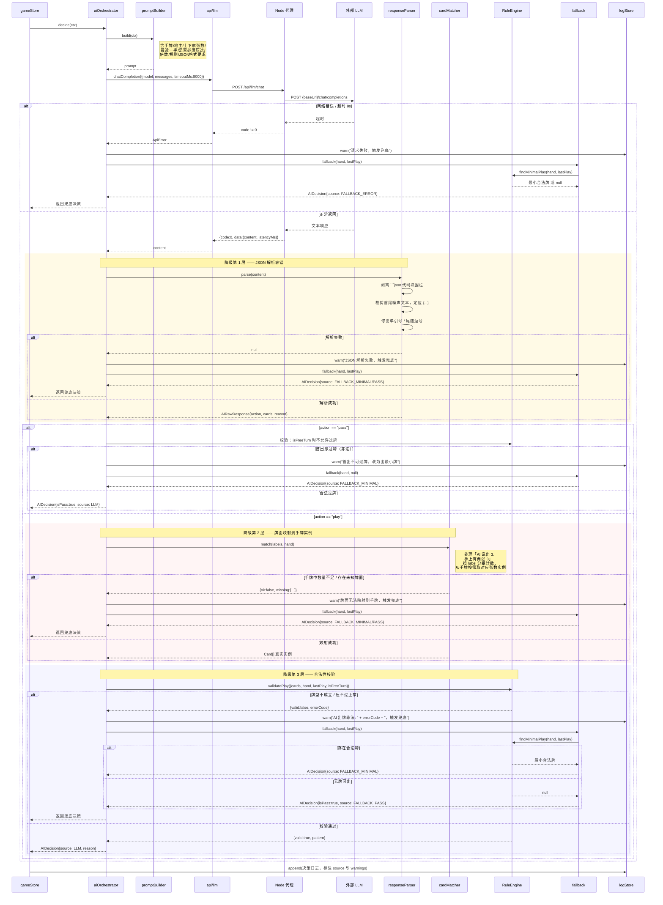
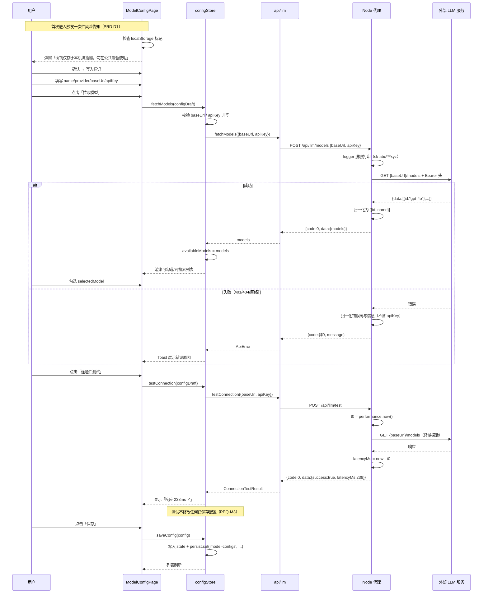
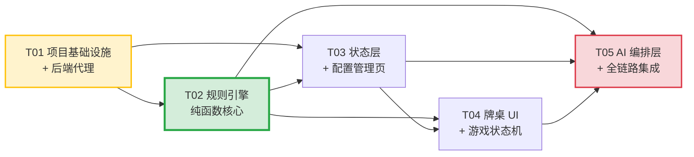

# AI 斗地主游戏应用 · 系统架构设计文档（DESIGN）

> 文档版本：v1.0
> 作者：高见远（架构师）
> 上游依据：`docs/PRD.md` v1.0（许清楚 · 产品经理）
> 面向读者：工程师（施工图）、QA（测试依据）

---

## 1. 架构总览

### 1.1 架构裁决：从「纯前端直连」改为「前端 + 极简 Node 代理」

PRD 决策 D1 将大模型调用方式留为"前端直连，若不支持 CORS 由架构层评估代理"。**本设计对此做出终局裁决：必须引入极简 Node 后端代理，不再保留直连方案。**

判断依据：

| 事实 | 后果 |
|---|---|
| 大量 OpenAI 兼容服务（国内厂商、自建 vLLM / Ollama / LM Studio 网关）默认不返回 `Access-Control-Allow-Origin` | 浏览器对 `/v1/models`、`/v1/chat/completions` 的请求被 CORS 预检拦截 |
| 直连方案下 REQ-M2（拉取模型列表）、REQ-M3（连通性测试）、REQ-R8（AI 决策）三个 P0 需求 | **直接不可用**，且失败原因是浏览器安全策略，前端无任何代码手段可绕过 |
| 若把"是否可用"交给用户自行配置 CORS | 违背产品目标 G1「零代码接入」 |

因此：**引入一个职责被严格限定的 Node 代理层**，它只解决 CORS 与静态托管，不侵入产品的"单机"定位。

### 1.2 后端职责边界（严格限定，不得越界）

后端**只做两件事**：

1. **LLM 请求透传代理**：`POST /api/llm/models`、`POST /api/llm/chat`、`POST /api/llm/test`。从请求体取 `baseUrl` + `apiKey`，转发到目标服务，原样回传响应。
2. **生产环境静态托管**：托管前端 `dist/` 产物。

后端**明确不做**（这是硬约束，工程师不得扩展）：

- ❌ 不承载任何游戏逻辑（发牌、牌型、回合、结算全在前端）
- ❌ 不做任何持久化（无数据库、无文件写入、无 session）
- ❌ 不存储 API Key（内存中过一道即丢，不落盘、不进日志）
- ❌ 不做用户认证（单机单用户）
- ❌ 不做提示词构造（提示词在前端 `src/ai/promptBuilder.ts`）

一句话：**后端是一根管子，不是一个服务。** 把它从系统中拿掉，只会导致 CORS 报错，不会导致任何业务逻辑缺失。

### 1.3 分层架构图



### 1.4 四层边界说明

| 层 | 位置 | 依赖方向 | 关键约束 |
|---|---|---|---|
| **规则引擎层** | `src/engine/` | **不依赖任何其他层** | 纯 TypeScript 函数，零 IO、零 React、零 Zustand、零 `Date.now()`、零 `Math.random()`（随机数由外部注入种子）。这是可独立单测的核心资产 |
| **AI 编排层** | `src/ai/` | 依赖 engine（做校验与兜底）、依赖 api 客户端 | 不直接操作 React 状态；输出为纯数据 `AIDecision`，由 store 消费 |
| **状态层** | `src/store/` | 依赖 engine + ai + persist | 游戏状态机唯一权威来源；组件只读 store、只调 store action |
| **表现层** | `src/components/`、`src/pages/` | 只依赖 store | 组件内不得出现牌型判断逻辑，一律调 engine 或读 store 派生值 |

### 1.5 开发期 / 生产期运行形态



- **开发期**：`npm run dev` 通过 `concurrently` 同时拉起 Vite（5173）与 Node 代理（8787），Vite 的 `server.proxy` 把 `/api` 转发到 8787。**一条命令启动。**
- **生产期**：`npm run build` 产出 `dist/`，`npm start` 启动单个 Node 进程，既托管 `dist/` 又提供 `/api`，同源无跨域。**一条命令启动。**

### 1.6 API Key 流转路径（安全约定）

```
用户输入 → 前端 configStore → localStorage（明文，PRD D1 已接受）
                ↓
        请求体 { baseUrl, apiKey, ... }（HTTPS/本机 HTTP）
                ↓
        Node 代理进程内存（仅存在于单次请求生命周期）
                ↓
        转发为 Authorization: Bearer <key> → 目标 LLM 服务
```

硬性要求（工程师必须遵守）：

1. API Key **只在请求体中传递**，不放 URL query（避免进入访问日志）
2. 后端**禁止**将 `apiKey` 写入任何 `console.log` / 文件 / 响应体
3. 后端日志打印请求时，必须对 `apiKey` 做脱敏：`sk-abc***xyz`（见 §8 日志格式）
4. 前端 UI 默认以 `password` 类型展示 Key，提供显示/隐藏切换（PRD 4.1）
5. 首次进入模型配置页弹出一次性风险告知（PRD D1），确认后写入 `localStorage` 标记不再弹

---

## 2. 技术选型表

| 技术 | 版本 | 选它的理由 | 被否决的替代方案及原因 |
|---|---|---|---|
| **Vite** | ^5.4.0 | 启动与 HMR 极快；`server.proxy` 原生支持开发期反代，正好承接 CORS 方案；构建产物为静态 `dist/`，便于 Node 托管 | ❌ CRA：已停止维护、构建慢<br/>❌ Next.js：带 SSR/路由/服务端能力，本项目是单机 SPA，引入即过度设计 |
| **React** | ^18.3.1 | 团队通用度最高；并发特性对本项目无必要但无害；生态成熟 | ❌ Vue 3：无技术劣势，纯团队约定<br/>❌ Svelte：生态与人才储备较薄 |
| **TypeScript** | ^5.6.0 | 规则引擎有大量牌型联合类型与穷尽判断，`switch` 的 exhaustive check 能在编译期拦住"漏一个牌型分支"这类致命 bug——这正是本项目的命门 | ❌ JavaScript：规则引擎无类型约束，牌型分支遗漏只能靠运行时发现，不可接受 |
| **Tailwind CSS** | ^3.4.0 | 牌桌 UI 需要大量精确的定位/层叠/扇形排布，手写原子类比覆盖组件库默认样式更可控；响应式断点（PRD 4.5）用 `sm/md/lg` 前缀直接表达 | ❌ **MUI（明确否决）**：与 Tailwind 双套样式系统冲突（specificity 打架、需要 `!important` 或 `sx` 逃生舱）；牌桌是高度自定义 UI，组件库帮不上忙反成负担；包体增加 ~300KB<br/>❌ 纯 CSS Module：牌桌响应式要写大量媒体查询，冗长 |
| **Zustand** | ^5.0.0 | 游戏状态机需要在 React 之外（AI 异步编排、定时器回调）读写状态，Zustand 的 `getState()/setState()` 可脱离组件调用，天然契合；切片模式便于按 §8.5 划分 | ❌ Redux Toolkit：模板代码多，本项目单机无中间件需求<br/>❌ Context + useReducer：AI 编排在组件外驱动时取值困难，且频繁更新导致大范围重渲染 |
| **React Router** | ^6.28.0 | 4 个页面（模型配置/AI玩家/房间/牌桌）需要路由切换与地址栏可分享 | ❌ 手写条件渲染：页面数已达 4 个且有嵌套需求，手写会退化成劣质路由 |
| **Express** | ^4.21.0 | 代理层只需 3 个路由 + 静态托管，Express 的 API 最直白，工程师零学习成本 | ❌ Fastify：性能优势在本场景（本机、低 QPS）毫无意义<br/>❌ Node 原生 http：需手写路由与 body 解析，徒增代码 |
| **Vitest** | ^2.1.0 | 与 Vite 共用配置与转换管线，零额外配置；规则引擎的密集单测是 QA 阶段重点，需要快速反馈 | ❌ Jest：需额外配置 ts 转换与 ESM，与 Vite 生态割裂 |
| **undici / 原生 fetch** | Node 22 内置 | Node 18+ 已内置 `fetch`，代理转发无需引入 axios | ❌ axios：后端仅做透传，原生 fetch 足够，少一个依赖 |
| **clsx** | ^2.1.1 | Tailwind 条件类名拼接，避免模板字符串拼接出错 | ❌ classnames：clsx 更小、API 一致 |
| **nanoid** | ^5.0.0 | 生成 Card / ModelConfig / AIPlayer 的唯一 id | ❌ uuid：体积更大，本项目不需要 RFC 4122 规范性 |
| **concurrently** | ^9.1.0 | 开发期一条命令同时拉起 Vite 与 Node 代理，满足"一条命令启动" | ❌ 让用户开两个终端：违背易用性要求 |
| **tsx** | ^4.19.0 | 直接运行 TypeScript 后端源码，开发期免编译；生产期同样可用 | ❌ ts-node：ESM 支持较麻烦<br/>❌ 后端写 JS：与前端类型无法共享 |

### 2.1 明确不引入的技术（防止过度设计）

本项目是**本机运行的单机应用**，以下技术一律不引入，工程师如认为必要须先向架构师提出：

- ❌ 数据库（SQLite / IndexedDB 封装库）—— `localStorage` 足够，数据量在 KB 级
- ❌ Docker / 容器化 —— 用户直接 `npm start`
- ❌ 消息队列 / 微服务 / GraphQL
- ❌ 状态持久化中间件（redux-persist 等）—— 手写 `localStorage` 适配器约 40 行
- ❌ UI 组件库（MUI / Ant Design / shadcn）—— 见选型表否决理由
- ❌ 服务端渲染 / SEO 相关
- ❌ WebSocket —— 无联机需求（PRD Q1）

---

## 3. 完整文件清单

> 约定：所有路径相对项目根目录 `AI_DouDiZhu/`。工程师须严格按此结构创建，不得自行增减顶层目录。

### 3.1 根目录配置

| 文件路径 | 职责 |
|---|---|
| `package.json` | 依赖声明与脚本（`dev` / `build` / `start` / `test`） |
| `tsconfig.json` | 前端 TS 配置，`strict: true`，路径别名 `@/* → src/*` |
| `tsconfig.node.json` | Vite 配置与 server 端的 TS 配置 |
| `vite.config.ts` | Vite 配置：React 插件、路径别名、`server.proxy` 将 `/api` 反代到 `:8787`、Vitest 配置 |
| `tailwind.config.ts` | Tailwind 配置：内容扫描路径、牌桌主题色扩展、响应式断点 |
| `postcss.config.js` | PostCSS 配置（tailwindcss + autoprefixer） |
| `index.html` | SPA 入口 HTML，挂载点 `#root` |
| `.env.example` | 环境变量样例（`PORT=8787`），**不含任何真实密钥** |
| `.gitignore` | 忽略 `node_modules` / `dist` / `.env` / 覆盖率报告 |
| `README.md` | 启动说明：安装、开发、构建、运行 |

### 3.2 后端（`server/`）—— 仅代理与托管

| 文件路径 | 职责 |
|---|---|
| `server/index.ts` | Express 入口：注册中间件、挂载 `/api/llm` 路由、生产环境托管 `dist/` 与 SPA fallback、监听端口 |
| `server/routes/llm.ts` | 三个透传路由 `POST /models`、`POST /chat`、`POST /test` 的定义与参数校验 |
| `server/services/llmProxy.ts` | 实际转发逻辑：拼接目标 URL、设置 `Authorization` 头、`fetch` 转发、超时控制、错误归一化 |
| `server/utils/logger.ts` | 统一日志输出，**内置 apiKey 脱敏函数**，禁止原样打印密钥 |
| `server/types.ts` | 后端请求/响应类型定义（与前端 `src/types/api.ts` 保持字段一致） |

### 3.3 规则引擎（`src/engine/`）—— 纯函数、零 IO、零 React

> **本目录是项目质量命门。** 任何文件不得 `import` React / Zustand / 浏览器 API；不得调用 `Math.random()`、`Date.now()`（随机源由参数注入）。QA 阶段将对本目录做密集单元测试。

| 文件路径 | 职责 |
|---|---|
| `src/engine/constants.ts` | 牌面常量：rank 3~17 与显示label映射、花色枚举、牌型枚举 `CardTypeEnum`、各牌型最小长度约束 |
| `src/engine/cards.ts` | 牌堆构造与发牌：`createDeck()` 生成 54 张唯一牌、`shuffle(deck, rng)` 注入随机源、`deal(deck)` 拆分 17/17/17/3 |
| `src/engine/cardType.ts` | **牌型识别核心**：`identifyPattern(cards): HandPattern \| null`，覆盖 12 种牌型；内含各牌型的独立判定子函数 |
| `src/engine/compare.ts` | 牌型比较：`canBeat(candidate, target): boolean`，处理炸弹/王炸的跨类型压制规则 |
| `src/engine/validator.ts` | 出牌合法性校验：`validatePlay(cards, hand, lastPlay, isFreeTurn): ValidationResult`，校验"牌在手上""牌型成立""压得过上家" |
| `src/engine/hint.ts` | 提示出牌：`findHints(hand, lastPlay): Card[][] ` 返回所有可压过的候选；`findMinimalPlay(hand, lastPlay)` 返回最小合法牌（AI 兜底复用） |
| `src/engine/score.ts` | 积分结算：`calculateSettlement(ctx): SettlementResult`，实现 PRD D3 的底分×倍数、春天/反春天判定、地主×2 |
| `src/engine/bidding.ts` | 叫分逻辑：`getLegalBids(currentMax)` 返回合法叫分选项、`resolveBidding(bids)` 判定地主与底分 |
| `src/engine/sort.ts` | 手牌排序：`sortCards(cards, mode)` 支持按 rank 降序 / 按连牌成组，供 UI 与 AI 提示词共用 |
| `src/engine/index.ts` | 引擎统一出口，re-export 全部公开函数与类型 |

### 3.4 AI 编排层（`src/ai/`）

| 文件路径 | 职责 |
|---|---|
| `src/ai/promptBuilder.ts` | 构造提示词：按 PRD D4 组织手牌、地主标识、上下家剩余张数、最近一手、是否必须压过、当前倍数、规则简述、JSON 输出格式要求 |
| `src/ai/responseParser.ts` | **降级第 1 层**：解析 LLM 文本 → `{action, cards, reason}`，含 markdown 代码块剥离、前后噪声裁剪、单引号修复等容错 |
| `src/ai/cardMatcher.ts` | **降级第 2 层**：将 AI 返回的牌面标签（如 `["3","3","K"]`）映射为手牌中的真实 `Card` 实例，处理重复牌面的选牌与"手牌不足"检测 |
| `src/ai/aiOrchestrator.ts` | AI 决策总编排：串联提示词→请求→解析→映射→校验→兜底的完整链路，产出 `AIDecision`，每层失败写入思考日志 |
| `src/ai/fallback.ts` | **降级第 3 层**：兜底策略，调用 `engine/hint.findMinimalPlay`，无合法牌则返回过牌决策 |
| `src/ai/bidStrategy.ts` | AI 叫分决策：调用 LLM 决定叫分；解析失败时按手牌强度启发式兜底 |

### 3.5 API 客户端（`src/api/`）

| 文件路径 | 职责 |
|---|---|
| `src/api/client.ts` | 统一 fetch 封装：基础 URL、超时（AbortController）、错误归一化为 `ApiError` |
| `src/api/llm.ts` | 三个后端接口的调用函数：`fetchModels()`、`chatCompletion()`、`testConnection()` |

### 3.6 状态层（`src/store/`）

| 文件路径 | 职责 |
|---|---|
| `src/store/configStore.ts` | 模型配置切片：CRUD、持久化、拉取模型列表、连通性测试状态（REQ-M1~M4） |
| `src/store/playerStore.ts` | AI 玩家切片：CRUD、持久化、"使用中保护"校验（REQ-A1~A3） |
| `src/store/roomStore.ts` | 房间切片：模式选择、座位分配、开始条件校验（REQ-R1、G1、G2） |
| `src/store/gameStore.ts` | **游戏状态机核心**：发牌、叫分、定地主、出牌、过牌、回合流转、结算（REQ-R2~R7） |
| `src/store/logStore.ts` | 思考日志切片：追加日志条目、按局清空（REQ-U2） |
| `src/store/persist.ts` | localStorage 适配器：读写、JSON 序列化、版本号与损坏数据兜底 |

### 3.7 类型定义（`src/types/`）

| 文件路径 | 职责 |
|---|---|
| `src/types/card.ts` | `Card`、`Suit`、`Rank`、`CardTypeEnum`、`HandPattern` |
| `src/types/game.ts` | `GameState`、`GamePhase`、`Player`、`PlayRecord`、`BidRecord`、`SettlementResult` |
| `src/types/config.ts` | `ModelConfig`、`AIPlayer`、`Room`、`RoomMode`、`Seat` |
| `src/types/ai.ts` | `AIDecision`、`AIRawResponse`、`DecisionSource`、`ThinkingLog` |
| `src/types/api.ts` | 前后端共享的请求/响应类型（与 `server/types.ts` 对齐） |

### 3.8 页面（`src/pages/`）

| 文件路径 | 职责 |
|---|---|
| `src/pages/ModelConfigPage.tsx` | 模型配置页（PRD 4.1）：列表 + 新增/编辑表单 + 拉取模型 + 连通性测试 |
| `src/pages/AIPlayerPage.tsx` | AI 玩家管理页（PRD 4.2）：列表 + 新建/编辑表单 |
| `src/pages/RoomPage.tsx` | 房间创建页（PRD 4.3）：模式选择 + 座位分配 + 开始游戏 |
| `src/pages/GameTablePage.tsx` | 牌桌页（PRD 4.4）：组合牌桌全部区域，驱动游戏循环 |

### 3.9 组件（`src/components/`）

| 文件路径 | 职责 |
|---|---|
| `src/components/common/Button.tsx` | 统一按钮（primary/secondary/danger 变体） |
| `src/components/common/Modal.tsx` | 通用弹窗（表单与风险告知复用） |
| `src/components/common/Input.tsx` | 表单输入框，支持 password 类型与显示/隐藏切换（API Key 用） |
| `src/components/common/Select.tsx` | 下拉选择（绑定模型、座位分配用） |
| `src/components/common/Toast.tsx` | 轻提示（操作成功/失败反馈） |
| `src/components/card/CardView.tsx` | 单张牌渲染：花色、点数、选中态上浮 |
| `src/components/card/HandCards.tsx` | 我的手牌区：扇形/平铺排布、多选、移动端横向滑动（REQ-U3） |
| `src/components/card/CardGroup.tsx` | 出牌区牌组展示（只读，用于中央出牌区与最近一手） |
| `src/components/table/OpponentPanel.tsx` | 对手信息面板：名称、地主标识、剩余手牌数、最近一手 |
| `src/components/table/PlayArea.tsx` | 中央出牌区：展示当前回合方所出牌型 |
| `src/components/table/TableHeader.tsx` | 顶部信息条：倒计时、底分、倍数、明牌区 3 张底牌 |
| `src/components/table/ActionBar.tsx` | 底部操作条：不出/过、提示、出牌 |
| `src/components/table/BiddingPanel.tsx` | 叫分面板：1/2/3 分与不叫按钮，按合法性禁用 |
| `src/components/table/ThinkingLogPanel.tsx` | AI 思考日志面板：桌面常驻、移动端折叠抽屉（REQ-U2、U3） |
| `src/components/table/SettlementModal.tsx` | 结算弹窗：胜负、底分、倍数明细、得分、再来一局 |
| `src/components/layout/AppLayout.tsx` | 应用外壳：导航栏 + 路由出口 |

### 3.10 工具与入口

| 文件路径 | 职责 |
|---|---|
| `src/utils/cn.ts` | `clsx` 封装，Tailwind 条件类名拼接 |
| `src/utils/id.ts` | `nanoid` 封装，生成各类实体 id |
| `src/utils/format.ts` | 格式化：延迟 ms、时间戳、牌面 label |
| `src/hooks/useCountdown.ts` | 倒计时 Hook（人类玩家 30s，PRD D4） |
| `src/hooks/useMediaQuery.ts` | 响应式断点判断，供组件切换桌面/移动布局 |
| `src/router.tsx` | React Router 路由表 |
| `src/main.tsx` | React 应用入口，挂载 Router |
| `src/App.tsx` | 根组件，包裹 Layout 与全局 Toast |
| `src/index.css` | Tailwind 指令与少量全局样式（牌面字体、滚动条） |

### 3.11 测试（`tests/`）

| 文件路径 | 职责 |
|---|---|
| `tests/engine/cardType.test.ts` | 牌型识别单测：12 种牌型正例 + 边界反例 |
| `tests/engine/compare.test.ts` | 牌型比较单测：同类型比大小、炸弹压制、王炸最大 |
| `tests/engine/validator.test.ts` | 合法性校验单测：牌不在手、牌型不成立、压不过 |
| `tests/engine/hint.test.ts` | 提示与最小牌单测 |
| `tests/engine/score.test.ts` | 结算单测：底分、炸弹倍数、春天、地主×2 |
| `tests/engine/cards.test.ts` | 发牌单测：54 张无重复、17/17/17/3 |
| `tests/ai/responseParser.test.ts` | 解析容错单测：markdown 包裹、噪声前后缀、非法 JSON |
| `tests/ai/cardMatcher.test.ts` | 牌面映射单测：重复牌面选牌、手牌不足 |

---

## 4. 核心数据结构与接口

> 以下 TypeScript 代码块可**直接复制**到对应文件。工程师不得擅自修改字段名（QA 测试与 AI 提示词均依赖这些命名）。

### 4.1 牌的表示法（`src/types/card.ts`）

**设计决策：rank 采用 3~17 的连续整数**，让"顺子=连续 rank"这一判定退化为简单的差值检查，避免 J/Q/K/A 的字符映射在比较逻辑里反复转换。

| rank | 牌面 | 说明 |
|---|---|---|
| 3~10 | 3,4,5,6,7,8,9,10 | 数值即 rank |
| 11 | J | |
| 12 | Q | |
| 13 | K | |
| 14 | A | |
| 15 | 2 | **不参与顺子/连对/飞机** |
| 16 | 小王 | **不参与顺子/连对/飞机**，花色为 `JOKER` |
| 17 | 大王 | **不参与顺子/连对/飞机**，花色为 `JOKER` |

> **关键规则**：连续性牌型（顺子、连对、飞机）的 rank 上界是 **14（A）**，即最大顺子为 `10-J-Q-K-A`。判定函数中必须显式过滤 `rank >= 15`。

```typescript
// src/types/card.ts

/** 花色。JOKER 为大小王专用花色 */
export type Suit = 'SPADE' | 'HEART' | 'CLUB' | 'DIAMOND' | 'JOKER';

/** 牌面等级：3~17，其中 15=2, 16=小王, 17=大王 */
export type Rank = number;

/** 连续性牌型（顺子/连对/飞机）允许的最大 rank —— A */
export const MAX_SEQUENCE_RANK = 14;
/** 小王 rank */
export const RANK_JOKER_SMALL = 16;
/** 大王 rank */
export const RANK_JOKER_BIG = 17;

/** 一张牌。id 全局唯一，用于在手牌中精确定位实例 */
export interface Card {
  /** 唯一标识，形如 "SPADE-3-a1b2"，同 rank 同花色也不会重复 */
  id: string;
  /** 花色 */
  suit: Suit;
  /** 等级 3~17 */
  rank: Rank;
  /** 显示用文本，如 "3" "J" "2" "小王" "大王" */
  label: string;
}

/** 12 种牌型枚举 —— 覆盖 PRD REQ-R5 全部要求 */
export enum CardTypeEnum {
  /** 单张 */
  SINGLE = 'SINGLE',
  /** 对子 */
  PAIR = 'PAIR',
  /** 三张 */
  TRIPLE = 'TRIPLE',
  /** 三带一（单） */
  TRIPLE_WITH_SINGLE = 'TRIPLE_WITH_SINGLE',
  /** 三带一对 */
  TRIPLE_WITH_PAIR = 'TRIPLE_WITH_PAIR',
  /** 顺子，≥5 张连续单牌 */
  STRAIGHT = 'STRAIGHT',
  /** 连对，≥3 组连续对子 */
  DOUBLE_STRAIGHT = 'DOUBLE_STRAIGHT',
  /** 飞机（纯三顺，≥2 组连续三张，不带翼） */
  PLANE = 'PLANE',
  /** 飞机带单翼 */
  PLANE_WITH_SINGLES = 'PLANE_WITH_SINGLES',
  /** 飞机带对翼 */
  PLANE_WITH_PAIRS = 'PLANE_WITH_PAIRS',
  /** 四带二（两单 或 两对） */
  FOUR_WITH_TWO = 'FOUR_WITH_TWO',
  /** 炸弹（四张同点） */
  BOMB = 'BOMB',
  /** 王炸（双王） */
  ROCKET = 'ROCKET',
}

/** 牌型识别结果 */
export interface HandPattern {
  /** 牌型 */
  type: CardTypeEnum;
  /**
   * 比较基准值。
   * - 单张/对子/三张/炸弹：该点数 rank
   * - 三带X：三张部分的 rank
   * - 顺子/连对/飞机：序列的**最大** rank
   * - 四带二：四张部分的 rank
   * - 王炸：固定 999
   */
  mainRank: number;
  /** 组成该牌型的牌数（比较同类型时长度必须相等，如 5 连顺不能压 6 连顺） */
  length: number;
  /** 原始牌集合 */
  cards: Card[];
}
```

### 4.2 牌型比较规则（工程师必须严格实现）

```
1. 王炸（ROCKET）压一切
2. 炸弹（BOMB）压除王炸外的一切非炸弹牌型；炸弹之间比 mainRank
3. 其余牌型：必须 type 相同 且 length 相同，再比 mainRank
   —— 5 张顺子不能压 6 张顺子（length 不等，不可比）
   —— 三带一 不能压 三带一对（type 不同）
4. 首出（isFreeTurn=true）时任意合法牌型均可出
```

### 4.3 游戏状态（`src/types/game.ts`）

```typescript
// src/types/game.ts
import type { Card, HandPattern } from './card';

/** 游戏阶段状态机 */
export enum GamePhase {
  /** 未开始 */
  IDLE = 'IDLE',
  /** 发牌中 */
  DEALING = 'DEALING',
  /** 叫分中 */
  BIDDING = 'BIDDING',
  /** 出牌中 */
  PLAYING = 'PLAYING',
  /** 已结算 */
  SETTLED = 'SETTLED',
}

/** 座位索引：0 / 1 / 2 */
export type SeatIndex = 0 | 1 | 2;

/** 玩家类型 */
export type PlayerKind = 'HUMAN' | 'AI';

/** 对局中的玩家 */
export interface Player {
  /** 座位索引 */
  seat: SeatIndex;
  /** 展示名称 */
  name: string;
  /** 人类 or AI */
  kind: PlayerKind;
  /** AI 玩家配置 id（kind 为 AI 时必填，关联 AIPlayer.id） */
  aiPlayerId?: string;
  /** 当前手牌 */
  hand: Card[];
  /** 是否地主 */
  isLandlord: boolean;
}

/** 一次出牌记录（过牌时 cards 为空、pattern 为 null） */
export interface PlayRecord {
  seat: SeatIndex;
  cards: Card[];
  /** 过牌时为 null */
  pattern: HandPattern | null;
  /** 是否为"过" */
  isPass: boolean;
  /** 回合序号，从 0 递增 */
  turn: number;
}

/** 叫分记录 */
export interface BidRecord {
  seat: SeatIndex;
  /** 0 表示不叫，1/2/3 为叫分 */
  score: 0 | 1 | 2 | 3;
}

/** 结算结果 */
export interface SettlementResult {
  /** 地主是否获胜 */
  landlordWin: boolean;
  /** 底分（最高叫分） */
  baseScore: number;
  /** 最终倍数 */
  multiplier: number;
  /** 单局基础分 = baseScore * multiplier */
  unitScore: number;
  /** 各座位得分，正数为赢负数为输，索引即 seat */
  seatScores: [number, number, number];
  /** 是否春天 */
  isSpring: boolean;
  /** 是否反春天 */
  isAntiSpring: boolean;
  /** 倍数构成明细，用于结算弹窗展示 */
  multiplierDetail: Array<{ reason: string; factor: number }>;
}

/** 游戏总状态（gameStore 的 state 形状） */
export interface GameState {
  phase: GamePhase;
  /** 三个玩家，索引即 seat */
  players: [Player, Player, Player];
  /** 3 张底牌 */
  bottomCards: Card[];
  /** 底牌是否已明牌（定地主后为 true，PRD D5） */
  bottomRevealed: boolean;
  /** 地主座位，未定为 null */
  landlordSeat: SeatIndex | null;
  /** 当前轮到的座位 */
  currentSeat: SeatIndex;
  /** 场上最近一手有效出牌（非过牌），无则 null */
  lastPlay: PlayRecord | null;
  /** 当前是否自由出牌（无需压过上家） */
  isFreeTurn: boolean;
  /** 全部出牌历史 */
  playHistory: PlayRecord[];
  /** 叫分记录 */
  bidHistory: BidRecord[];
  /** 当前最高叫分 */
  highestBid: number;
  /** 叫分起始座位 */
  biddingStartSeat: SeatIndex;
  /** 底分 */
  baseScore: number;
  /** 当前倍数 */
  multiplier: number;
  /** 结算结果，未结算为 null */
  settlement: SettlementResult | null;
  /** 回合计数 */
  turn: number;
}
```

### 4.4 配置与房间（`src/types/config.ts`）

```typescript
// src/types/config.ts

/** 模型配置（REQ-M1） */
export interface ModelConfig {
  id: string;
  /** 配置名称，如 "配置A" */
  name: string;
  /** 服务商名称，如 "OpenAI" */
  provider: string;
  /** Base URL，如 "https://api.openai.com/v1" */
  baseUrl: string;
  /** API Key，明文存 localStorage（PRD D1 已接受，加密为 P2） */
  apiKey: string;
  /** 已拉取的可用模型 id 列表 */
  availableModels: string[];
  /** 用户选定的默认模型 id */
  selectedModel: string;
  createdAt: number;
  updatedAt: number;
}

/** 连通性测试结果（REQ-M3） */
export interface ConnectionTestResult {
  success: boolean;
  /** 响应延迟（毫秒） */
  latencyMs: number;
  /** 失败时的错误信息 */
  error?: string;
  testedAt: number;
}

/** AI 玩家（REQ-A1） */
export interface AIPlayer {
  id: string;
  /** 玩家名称，如 "小明" */
  name: string;
  /** 绑定的 ModelConfig.id */
  modelConfigId: string;
  /** 绑定的具体模型 id（覆盖配置的默认模型，可选） */
  modelId?: string;
  /** 备注，如 "激进" */
  remark?: string;
  /** 头像 emoji 或 URL */
  avatar?: string;
  createdAt: number;
  updatedAt: number;
}

/** 对局模式 */
export type RoomMode = 'HUMAN_VS_AI' | 'AI_SPECTATE';

/** 座位配置 */
export interface Seat {
  index: 0 | 1 | 2;
  kind: 'HUMAN' | 'AI';
  /** kind 为 AI 时绑定的 AIPlayer.id */
  aiPlayerId?: string;
}

/** 房间（REQ-R1） */
export interface Room {
  id: string;
  mode: RoomMode;
  /** 三个座位 */
  seats: [Seat, Seat, Seat];
  createdAt: number;
}
```

### 4.5 AI 决策类型（`src/types/ai.ts`）

```typescript
// src/types/ai.ts
import type { Card } from './card';

/** 决策来源 —— 用于日志标注与 QA 判断降级是否生效 */
export enum DecisionSource {
  /** LLM 正常返回且校验通过 */
  LLM = 'LLM',
  /** LLM 返回非法，兜底出最小合法牌 */
  FALLBACK_MINIMAL = 'FALLBACK_MINIMAL',
  /** LLM 返回非法且无合法牌可出，兜底过牌 */
  FALLBACK_PASS = 'FALLBACK_PASS',
  /** 请求超时或网络错误后兜底 */
  FALLBACK_ERROR = 'FALLBACK_ERROR',
}

/** LLM 原始返回结构（约定的 JSON 契约，PRD D4） */
export interface AIRawResponse {
  /** "play" 出牌 | "pass" 过牌 */
  action: 'play' | 'pass';
  /** 牌面标签数组，如 ["3","3","K"]；pass 时为空 */
  cards: string[];
  /** 决策理由，展示于思考日志（REQ-U2） */
  reason: string;
}

/** AI 最终决策（编排层输出，store 消费） */
export interface AIDecision {
  /** 是否过牌 */
  isPass: boolean;
  /** 要出的真实 Card 实例（已映射到手牌） */
  cards: Card[];
  /** 决策理由 */
  reason: string;
  /** 决策来源，标识是否走了降级 */
  source: DecisionSource;
  /** 降级过程中记录的告警，供日志展示 */
  warnings: string[];
  /** 本次决策耗时（毫秒） */
  latencyMs: number;
}

/** 思考日志条目（REQ-U2） */
export interface ThinkingLog {
  id: string;
  seat: 0 | 1 | 2;
  playerName: string;
  /** 日志级别 */
  level: 'info' | 'warn' | 'error';
  /** 正文 */
  message: string;
  /** 决策来源，非决策类日志为 undefined */
  source?: DecisionSource;
  timestamp: number;
}
```

### 4.6 前后端 API 契约（`src/types/api.ts` / `server/types.ts`）

> 两个文件字段必须完全一致。响应统一为 `{ code, data, message }` 信封（见 §8.3）。

```typescript
// src/types/api.ts

/** 统一响应信封 */
export interface ApiResponse<T> {
  /** 0 表示成功，非 0 为错误码 */
  code: number;
  data: T | null;
  message: string;
}

/** 所有 LLM 代理请求的公共字段 */
export interface LLMBaseRequest {
  baseUrl: string;
  apiKey: string;
}

/** POST /api/llm/models —— 拉取模型列表（REQ-M2） */
export type FetchModelsRequest = LLMBaseRequest;
export interface FetchModelsResponse {
  models: Array<{ id: string; name: string }>;
}

/** POST /api/llm/test —— 连通性测试（REQ-M3） */
export type TestConnectionRequest = LLMBaseRequest;
export interface TestConnectionResponse {
  success: boolean;
  latencyMs: number;
}

/** POST /api/llm/chat —— 对话补全（REQ-R8） */
export interface ChatRequest extends LLMBaseRequest {
  model: string;
  messages: Array<{ role: 'system' | 'user' | 'assistant'; content: string }>;
  temperature?: number;
  /** 请求超时毫秒数，默认 8000（PRD D4） */
  timeoutMs?: number;
}
export interface ChatResponse {
  /** 模型返回的文本内容 */
  content: string;
  /** 实际耗时 */
  latencyMs: number;
}
```

### 4.7 规则引擎公开接口签名（`src/engine/index.ts`）

```typescript
// 引擎对外暴露的全部函数签名 —— 纯函数，无副作用

/** 生成 54 张唯一牌 */
export function createDeck(): Card[];

/** 洗牌。rng 为注入的随机源，默认 Math.random；注入种子可复现测试 */
export function shuffle(deck: Card[], rng?: () => number): Card[];

/** 发牌：返回三家各 17 张 + 3 张底牌 */
export function deal(deck: Card[]): {
  hands: [Card[], Card[], Card[]];
  bottom: Card[];
};

/** 牌型识别。无法识别返回 null */
export function identifyPattern(cards: Card[]): HandPattern | null;

/** 判断 candidate 能否压过 target。target 为 null 表示首出 */
export function canBeat(candidate: HandPattern, target: HandPattern | null): boolean;

/** 出牌合法性校验 */
export function validatePlay(params: {
  cards: Card[];
  hand: Card[];
  lastPlay: HandPattern | null;
  isFreeTurn: boolean;
}): ValidationResult;

export interface ValidationResult {
  valid: boolean;
  /** 校验通过时的牌型 */
  pattern?: HandPattern;
  /** 失败原因码，见 §8.4 */
  errorCode?: string;
  /** 失败的人类可读描述 */
  errorMessage?: string;
}

/** 找出所有能压过 lastPlay 的候选出牌（REQ 提示功能） */
export function findHints(hand: Card[], lastPlay: HandPattern | null): Card[][];

/** 找出最小的合法出牌，无解返回 null（AI 兜底复用） */
export function findMinimalPlay(hand: Card[], lastPlay: HandPattern | null): Card[] | null;

/** 手牌排序 */
export function sortCards(cards: Card[], mode?: 'rank' | 'group'): Card[];

/** 合法叫分选项 */
export function getLegalBids(currentMax: number): Array<0 | 1 | 2 | 3>;

/** 叫分结算：判定地主与底分 */
export function resolveBidding(bids: BidRecord[]): {
  landlordSeat: SeatIndex | null;
  baseScore: number;
  /** 全不叫需重发 */
  needRedeal: boolean;
};

/** 积分结算（PRD D3） */
export function calculateSettlement(ctx: {
  landlordSeat: SeatIndex;
  winnerSeat: SeatIndex;
  baseScore: number;
  bombCount: number;
  hasRocket: boolean;
  playHistory: PlayRecord[];
}): SettlementResult;
```

### 4.8 类图



---

## 5. 关键流程时序图

### 5.1 完整对局流程（发牌 → 叫分 → 定地主 → 明底牌 → 出牌循环 → 结算）



### 5.2 AI 决策链路（含三层降级兜底 · REQ-R8）

> 这是本项目的可靠性核心。**任何一层失败都必须降级并记录日志，绝不允许抛出异常中断对局。**



**降级链路要点（工程师必须实现）：**

| 层 | 位置 | 失败场景 | 降级动作 |
|---|---|---|---|
| 第 0 层 | `api/llm.ts` | 网络错误、8s 超时、HTTP 非 2xx | → `FALLBACK_ERROR` |
| 第 1 层 | `responseParser.ts` | 返回非 JSON、被 markdown 围栏包裹、掺杂解释文本、单引号 | 先容错修复，仍失败 → 兜底 |
| 第 2 层 | `cardMatcher.ts` | 牌面标签手牌中不存在、数量不足、标签拼写异常 | → 兜底 |
| 第 3 层 | `validator.ts` | 牌型不成立、压不过上家、首出却过牌 | → 兜底 |
| 兜底 | `fallback.ts` | —— | 有合法牌出最小牌；无则过牌 |

> **`cardMatcher` 的重复牌面处理规则**：将 AI 返回的 labels 按值分组计数（如 `["3","3","K"]` → `{3:2, K:1}`），再从手牌中按每个 label 取出对应数量的 `Card` 实例；同 label 有多张时**优先取花色排序靠前的**，保证结果确定可测。若手牌中某 label 数量少于需求，判定映射失败。

### 5.3 模型列表拉取与连通性测试（REQ-M2 / M3）



---

## 6. 任务列表

> 按实现顺序排列，**工程师必须按序施工**。每项标注涉及文件、前置依赖、完成判据。
> 分组原则：按架构层次聚合，避免单文件成任务导致的碎片化。

### T01 · 项目基础设施与后端代理

| 项 | 内容 |
|---|---|
| **任务ID** | T01 |
| **优先级** | P0 |
| **前置依赖** | 无 |
| **涉及文件** | `package.json`、`tsconfig.json`、`tsconfig.node.json`、`vite.config.ts`、`tailwind.config.ts`、`postcss.config.js`、`index.html`、`.env.example`、`.gitignore`、`README.md`、`src/main.tsx`、`src/App.tsx`、`src/index.css`、`src/router.tsx`、`src/utils/cn.ts`、`src/utils/id.ts`、`src/types/api.ts`、`server/index.ts`、`server/routes/llm.ts`、`server/services/llmProxy.ts`、`server/utils/logger.ts`、`server/types.ts` |
| **完成判据** | ① `npm run dev` 一条命令同时拉起 Vite(5173) 与 Node 代理(8787)，页面可访问且 Tailwind 样式生效<br/>② `npm run build && npm start` 后单进程 8787 同时托管 dist 与 /api，刷新任意路由不 404（SPA fallback 生效）<br/>③ 三个接口 `/api/llm/models`、`/api/llm/chat`、`/api/llm/test` 可用 curl 打通到真实 OpenAI 兼容服务<br/>④ 后端日志中 apiKey 已脱敏，全局搜索确认无原样打印<br/>⑤ 后端代码中不含任何游戏逻辑与持久化代码 |

### T02 · 规则引擎（纯函数核心）

| 项 | 内容 |
|---|---|
| **任务ID** | T02 |
| **优先级** | P0 |
| **前置依赖** | T01 |
| **涉及文件** | `src/types/card.ts`、`src/types/game.ts`、`src/engine/constants.ts`、`src/engine/cards.ts`、`src/engine/cardType.ts`、`src/engine/compare.ts`、`src/engine/validator.ts`、`src/engine/hint.ts`、`src/engine/sort.ts`、`src/engine/bidding.ts`、`src/engine/score.ts`、`src/engine/index.ts` |
| **完成判据** | ① `identifyPattern` 正确识别全部 12 种牌型（单/对/三/三带一/三带一对/顺子/连对/飞机/飞机带单/飞机带对/四带二/炸弹/王炸）<br/>② 连续性牌型正确排除 rank≥15（2 与双王不入顺子/连对/飞机）<br/>③ `canBeat` 正确处理王炸压一切、炸弹压非炸弹、同型同长比 mainRank<br/>④ `calculateSettlement` 符合 PRD D3：底分×倍数、炸弹/王炸各×2、春天×2、地主胜得基础分×2<br/>⑤ **`src/engine/` 下全局搜索无 `import React`、无 `zustand`、无 `localStorage`、无 `fetch`**<br/>⑥ `shuffle` 支持注入 rng，注入固定种子结果可复现 |

### T03 · 状态层与配置管理页

| 项 | 内容 |
|---|---|
| **任务ID** | T03 |
| **优先级** | P0 |
| **前置依赖** | T01、T02 |
| **涉及文件** | `src/types/config.ts`、`src/store/persist.ts`、`src/store/configStore.ts`、`src/store/playerStore.ts`、`src/store/roomStore.ts`、`src/store/logStore.ts`、`src/api/client.ts`、`src/api/llm.ts`、`src/components/common/*`（Button/Modal/Input/Select/Toast）、`src/components/layout/AppLayout.tsx`、`src/pages/ModelConfigPage.tsx`、`src/pages/AIPlayerPage.tsx`、`src/pages/RoomPage.tsx`、`src/utils/format.ts` |
| **完成判据** | ① 模型配置增删改查可用，刷新浏览器后配置仍在（REQ-M1/M4）<br/>② 「拉取模型」能取回真实模型列表并支持搜索勾选（REQ-M2）<br/>③ 「连通性测试」返回成功状态与延迟 ms，且不修改已保存配置（REQ-M3）<br/>④ AI 玩家增删改查可用，绑定模型为必选且限已存在配置（REQ-A1/A2）<br/>⑤ 房间页模式切换正确：人机模式选 2 AI、观战模式选 3 AI，未满员时「开始游戏」禁用（REQ-R1/G1/G2）<br/>⑥ 首次进入配置页弹出密钥风险告知，确认后不再弹（PRD D1）<br/>⑦ API Key 输入框默认密文，可切换显示/隐藏 |

### T04 · 牌桌 UI 与游戏状态机

| 项 | 内容 |
|---|---|
| **任务ID** | T04 |
| **优先级** | P0 |
| **前置依赖** | T02、T03 |
| **涉及文件** | `src/store/gameStore.ts`、`src/pages/GameTablePage.tsx`、`src/components/card/CardView.tsx`、`src/components/card/HandCards.tsx`、`src/components/card/CardGroup.tsx`、`src/components/table/TableHeader.tsx`、`src/components/table/OpponentPanel.tsx`、`src/components/table/PlayArea.tsx`、`src/components/table/ActionBar.tsx`、`src/components/table/BiddingPanel.tsx`、`src/components/table/SettlementModal.tsx`、`src/hooks/useCountdown.ts`、`src/hooks/useMediaQuery.ts` |
| **完成判据** | ① 发牌正确：三家各 17 张 + 3 张底牌，54 张无重复（REQ-R2）<br/>② 叫分流程符合 PRD D2：严格递增、每人一次、全不叫重发<br/>③ 定地主后底牌立即明牌且常驻，地主手牌变 20 张（REQ-R4/D5）<br/>④ 人类玩家可选牌出牌、过牌、点提示；非法出牌被拦截并提示（REQ-R5）<br/>⑤ 回合正确流转，连续两家过牌后回到自由出牌（REQ-R6）<br/>⑥ 一方出完牌触发结算弹窗，倍数明细与得分正确（REQ-R7）<br/>⑦ 桌面端（≥1024px）与移动端（<768px）布局均可用，含四要素：手牌数、出牌区、地主标识、倒计时（REQ-U1/U3）<br/>⑧ 人类回合 30s 倒计时归零自动过牌（PRD D4） |

### T05 · AI 编排层与全链路集成

| 项 | 内容 |
|---|---|
| **任务ID** | T05 |
| **优先级** | P0 |
| **前置依赖** | T02、T03、T04 |
| **涉及文件** | `src/types/ai.ts`、`src/ai/promptBuilder.ts`、`src/ai/responseParser.ts`、`src/ai/cardMatcher.ts`、`src/ai/fallback.ts`、`src/ai/aiOrchestrator.ts`、`src/ai/bidStrategy.ts`、`src/components/table/ThinkingLogPanel.tsx`、`src/pages/GameTablePage.tsx`（集成修改）、`src/store/gameStore.ts`（集成修改） |
| **完成判据** | ① 提示词含 PRD D4 全部要素（手牌、地主、上下家张数、最近一手、是否必须压过、倍数、规则、JSON 格式要求）<br/>② `responseParser` 能正确解析被 ```json 围栏包裹、含前后解释文本的返回<br/>③ `cardMatcher` 能处理「AI 说出 3、手上两张 3」的选牌，且手牌不足时判定失败<br/>④ **三层降级链路可验证**：分别构造解析失败、映射失败、校验失败三种输入，均能兜底出最小合法牌或过牌，不抛异常中断对局（REQ-R8）<br/>⑤ AI 请求 8s 硬超时触发兜底（PRD D4）<br/>⑥ 思考日志面板实时展示每个 AI 回合的决策理由与降级告警（REQ-U2）<br/>⑦ 观战模式 3 AI 全自动推进至结算，无需任何用户操作（REQ-G2）<br/>⑧ 人机模式完整对局可走通（REQ-G1） |

### 6.1 任务依赖图



> **关键路径**：T01 → T02 → T04 → T05。T02（规则引擎）是全项目的地基，其正确性决定整个产品是否可用，建议投入最多测试精力。

---

## 7. 依赖包清单

> 可直接粘贴进 `package.json`。Node 版本要求 **≥18**（需内置 `fetch`），推荐 20/22。

```json
{
  "name": "ai-doudizhu",
  "private": true,
  "version": "1.0.0",
  "type": "module",
  "engines": {
    "node": ">=18"
  },
  "scripts": {
    "dev": "concurrently -n web,api -c cyan,magenta \"vite\" \"tsx watch server/index.ts\"",
    "build": "tsc -b && vite build",
    "start": "cross-env NODE_ENV=production tsx server/index.ts",
    "preview": "vite preview",
    "test": "vitest run",
    "test:watch": "vitest",
    "test:coverage": "vitest run --coverage",
    "lint": "eslint . --ext ts,tsx",
    "typecheck": "tsc --noEmit"
  },
  "dependencies": {
    "react": "^18.3.1",
    "react-dom": "^18.3.1",
    "react-router-dom": "^6.28.0",
    "zustand": "^5.0.2",
    "clsx": "^2.1.1",
    "nanoid": "^5.0.9",
    "express": "^4.21.2",
    "cors": "^2.8.5"
  },
  "devDependencies": {
    "@types/react": "^18.3.17",
    "@types/react-dom": "^18.3.5",
    "@types/express": "^4.17.21",
    "@types/cors": "^2.8.17",
    "@types/node": "^22.10.2",
    "@vitejs/plugin-react": "^4.3.4",
    "typescript": "^5.6.3",
    "vite": "^5.4.11",
    "vitest": "^2.1.8",
    "@vitest/coverage-v8": "^2.1.8",
    "tailwindcss": "^3.4.17",
    "postcss": "^8.4.49",
    "autoprefixer": "^10.4.20",
    "tsx": "^4.19.2",
    "concurrently": "^9.1.0",
    "cross-env": "^7.0.3",
    "eslint": "^8.57.1",
    "@typescript-eslint/parser": "^7.18.0",
    "@typescript-eslint/eslint-plugin": "^7.18.0",
    "eslint-plugin-react-hooks": "^4.6.2"
  }
}
```

### 7.1 依赖说明

| 包 | 用途 | 备注 |
|---|---|---|
| `express` + `cors` | 后端代理与静态托管 | `cors` 仅用于开发期放行 5173 来源；生产同源实际不需要，但保留便于本机多端口调试 |
| `tsx` | 直接运行 TS 后端 | 开发期 `tsx watch` 热重载，生产期 `tsx` 直接运行，无需单独编译 server |
| `concurrently` | 一条命令启动前后端 | 满足"一条命令启动"的架构要求 |
| `cross-env` | 跨平台设置 NODE_ENV | Windows 下 `NODE_ENV=x` 语法不通用 |
| `@vitest/coverage-v8` | 覆盖率报告 | QA 阶段验证规则引擎覆盖率 |

> **注意**：不要引入 `axios`（Node 18+ 与浏览器均内置 `fetch`）、不要引入 `uuid`（已有 `nanoid`）、不要引入任何 UI 组件库。

---

## 8. 共享知识（跨文件约定）

> 所有工程师必须遵守。这些约定跨越多个文件，不统一将导致集成时返工。

### 8.1 命名规范

| 类别 | 规范 | 示例 |
|---|---|---|
| 文件名 · 组件 | PascalCase | `HandCards.tsx`、`SettlementModal.tsx` |
| 文件名 · 非组件 | camelCase | `cardType.ts`、`aiOrchestrator.ts` |
| 类型 / 接口 | PascalCase，**不加 `I` 前缀** | `Card`、`GameState`、`AIDecision` |
| 枚举 | PascalCase 类型名 + UPPER_SNAKE 成员 | `CardTypeEnum.TRIPLE_WITH_PAIR` |
| 常量 | UPPER_SNAKE | `MAX_SEQUENCE_RANK`、`AI_TIMEOUT_MS` |
| 函数 | camelCase 动词开头 | `identifyPattern`、`findMinimalPlay` |
| 布尔值 | `is` / `has` / `can` 前缀 | `isFreeTurn`、`hasRocket`、`canBeat` |
| Store action | 动词，不加 `set` 前缀（除非纯赋值） | `playCards()`、`startGame()`、`resetGame()` |
| 座位变量 | 一律用 `seat`，不用 `index` / `pos` | `currentSeat`、`landlordSeat` |

### 8.2 牌型枚举取值（唯一权威，禁止各自定义）

```
SINGLE / PAIR / TRIPLE / TRIPLE_WITH_SINGLE / TRIPLE_WITH_PAIR
STRAIGHT / DOUBLE_STRAIGHT / PLANE / PLANE_WITH_SINGLES / PLANE_WITH_PAIRS
FOUR_WITH_TWO / BOMB / ROCKET
```

各牌型约束速查表（`identifyPattern` 实现依据）：

| 牌型 | 张数 | 结构约束 | mainRank |
|---|---|---|---|
| SINGLE | 1 | —— | 该牌 rank |
| PAIR | 2 | 同 rank | 该 rank |
| TRIPLE | 3 | 同 rank | 该 rank |
| TRIPLE_WITH_SINGLE | 4 | 3 同 + 1 任意（该单张 rank ≠ 三张 rank） | 三张的 rank |
| TRIPLE_WITH_PAIR | 5 | 3 同 + 1 对 | 三张的 rank |
| STRAIGHT | ≥5 | 连续单牌，**rank ≤ 14** | 最大 rank |
| DOUBLE_STRAIGHT | ≥6（≥3 对） | 连续对子，**rank ≤ 14** | 最大 rank |
| PLANE | ≥6（≥2 组三张） | 连续三张，**rank ≤ 14** | 最大 rank |
| PLANE_WITH_SINGLES | n组×3 + n单 | 三顺连续且 rank ≤ 14，翼数=组数 | 三顺最大 rank |
| PLANE_WITH_PAIRS | n组×3 + n对 | 同上，翼为对子 | 三顺最大 rank |
| FOUR_WITH_TWO | 6 或 8 | 4 同 + 2 单，或 4 同 + 2 对 | 四张的 rank |
| BOMB | 4 | 4 同 rank | 该 rank |
| ROCKET | 2 | 小王 + 大王 | 固定 999 |

> **踩坑提醒**：`TRIPLE_WITH_SINGLE`（4 张）与 `BOMB`（4 张）张数相同，必须先判炸弹；`FOUR_WITH_TWO` 的 4+2 对（8 张）容易与飞机带对混淆，需先判四张再判三顺。

### 8.3 错误处理约定

**API 响应统一信封**（前后端一致）：

```typescript
{ code: number, data: T | null, message: string }
```

- `code === 0` 表示成功，非 0 为错误
- 前端 `api/client.ts` 统一拦截：`code !== 0` 时抛出 `ApiError`，调用方用 try/catch 处理
- **后端错误信息中禁止回显 apiKey**

**错误码分配**：

| 码段 | 含义 | 示例 |
|---|---|---|
| 0 | 成功 | —— |
| 1000~1099 | 请求参数错误 | 1001 缺少 baseUrl、1002 缺少 apiKey |
| 2000~2099 | 上游 LLM 服务错误 | 2001 认证失败(401)、2002 接口不存在(404)、2003 上游 5xx |
| 3000~3099 | 网络与超时 | 3001 请求超时、3002 连接失败 |
| 9000 | 未知错误 | —— |

**前端异常原则**：

- 规则引擎**不抛异常**，一律返回 `null` 或 `ValidationResult{valid:false, errorCode}`
- AI 编排层**不抛异常**，任何失败都降级为兜底决策（对局绝不能因 AI 报错中断）
- 只有用户操作类错误用 Toast 提示，AI 内部降级只写思考日志

**校验错误码**（`validator.ts` 返回值）：

```
CARD_NOT_IN_HAND     牌不在手牌中
INVALID_PATTERN      牌型不成立
CANNOT_BEAT          压不过上家
EMPTY_CARDS          未选择任何牌
PASS_NOT_ALLOWED     首出不可过牌
```

### 8.4 日志格式约定

**后端日志**（`server/utils/logger.ts`）：

```
[2025-01-15T10:23:45.123Z] [INFO] [llm/chat] baseUrl=https://api.openai.com/v1 model=gpt-4o key=sk-abc***xyz latency=1243ms
[2025-01-15T10:23:47.001Z] [ERROR] [llm/models] baseUrl=http://127.0.0.1:8000 key=sk-loc***001 code=3001 msg=请求超时
```

- 格式：`[ISO时间] [级别] [模块] key=value ...`
- **apiKey 脱敏规则**：保留前 6 位与后 3 位，中间替换为 `***`；长度不足 12 位时全部替换为 `***`
- 脱敏函数必须封装在 `logger.ts` 中统一调用，禁止各处自行拼接

**前端思考日志**（`ThinkingLog`，展示于面板）：

```
> 老李: 手牌偏单，先出对9试探，保留2与王                    [LLM]
> 小明: ⚠ JSON 解析失败，已兜底出最小合法牌 [3]           [FALLBACK_MINIMAL]
> 老李: ⚠ 请求超时(8s)，已兜底过牌                        [FALLBACK_PASS]
```

- 正常决策用 `info` 级别，降级用 `warn` 级别并加 `⚠` 前缀
- 面板右侧标注 `DecisionSource`，便于 QA 快速识别降级是否触发

### 8.5 Zustand Store 切片划分

| Store | 职责边界 | 关键 state | 关键 action | 持久化 |
|---|---|---|---|---|
| `configStore` | 模型配置 | `configs: ModelConfig[]`、`testResults` | `addConfig`、`updateConfig`、`deleteConfig`、`fetchModels`、`testConnection` | ✅ `dz.configs` |
| `playerStore` | AI 玩家 | `players: AIPlayer[]` | `addPlayer`、`updatePlayer`、`deletePlayer`、`isPlayerInUse` | ✅ `dz.players` |
| `roomStore` | 房间与座位 | `room: Room \| null` | `createRoom`、`setMode`、`assignSeat`、`canStart` | ❌ |
| `gameStore` | **游戏状态机** | `GameState` 全字段 | `startGame`、`bid`、`playCards`、`pass`、`nextTurn`、`settle`、`resetGame` | ❌ |
| `logStore` | 思考日志 | `logs: ThinkingLog[]` | `appendLog`、`clearLogs` | ❌ |

**切片间调用规则**：

- ✅ `gameStore` 可读 `roomStore`/`playerStore`/`configStore`（获取座位与模型信息）
- ✅ `gameStore` 可写 `logStore`（追加思考日志）
- ❌ `configStore`/`playerStore` **不得**反向依赖 `gameStore`
- ❌ 组件内**不得**跨 store 拼装业务逻辑，需要组合时在 `gameStore` 中封装 action

### 8.6 localStorage 键名约定

| 键名 | 内容 | 说明 |
|---|---|---|
| `dz.configs` | `ModelConfig[]` | 模型配置（含明文 apiKey） |
| `dz.players` | `AIPlayer[]` | AI 玩家 |
| `dz.meta.version` | `string` | 数据版本号，用于后续迁移 |
| `dz.meta.keyWarningAck` | `"1"` | 密钥风险告知已确认标记 |

- 统一通过 `src/store/persist.ts` 读写，禁止各处直接调用 `localStorage`
- 读取时必须 try/catch，JSON 解析失败返回默认值（防止手工篡改导致白屏）

### 8.7 关键常量集中定义（`src/engine/constants.ts` 与 `src/utils`）

```typescript
/** AI 决策硬超时（PRD D4） */
export const AI_TIMEOUT_MS = 8000;
/** 人类玩家回合倒计时（PRD D4） */
export const HUMAN_TURN_SECONDS = 30;
/** 连续性牌型最大 rank（A） */
export const MAX_SEQUENCE_RANK = 14;
/** 顺子最小长度 */
export const MIN_STRAIGHT_LEN = 5;
/** 连对最小对数 */
export const MIN_DOUBLE_STRAIGHT_PAIRS = 3;
/** 飞机最小三张组数 */
export const MIN_PLANE_GROUPS = 2;
/** 王炸的比较基准值 */
export const ROCKET_RANK = 999;
```

### 8.8 响应式断点约定（PRD 4.5）

| 断点 | Tailwind 前缀 | 布局 |
|---|---|---|
| < 768px | 默认（mobile first） | 竖向堆叠，日志折叠为抽屉，手牌横向滑动 |
| 768~1023px | `md:` | 复用移动端紧凑布局 |
| ≥ 1024px | `lg:` | 桌面三栏，日志面板常驻 |

---

## 9. 遗留问题与假设说明

| 编号 | 问题 | 架构处理 |
|---|---|---|
| Q4 | 三家全不叫的兜底 | 按 PRD D2 实现**重新发牌**。`resolveBidding` 返回 `needRedeal: true`，`gameStore` 重新走发牌流程。若后续改为"强制首叫者当地主"，仅需改动 `bidding.ts` 单个函数 |
| Q8 | CORS | **已由本设计终结**：统一走 Node 代理，不再保留直连分支。工程师不得实现"直连回退"逻辑 |
| Q12 | 倍数上限 | 首版不封顶（自然叠加）。已在 `constants.ts` 预留 `MAX_MULTIPLIER` 位置，需要时改一处即可 |
| —— | 底牌是否计入春天判定 | 按 PRD D3 表述实现：反春天判定为"地主仅出过底牌/未出过主动牌"。工程师实现时以"地主除首轮外未再出牌"为准，QA 阶段如有歧义需回问产品 |
| —— | AI 叫分是否也走 LLM | 本设计走 LLM（`bidStrategy.ts`），解析失败时按手牌强度启发式兜底（炸弹数 + 大牌数打分），保证叫分阶段不会卡死 |
| —— | 提示词语言 | 统一中文，降低国产模型理解成本 |

---

## 10. 给下游的重点提醒

**给工程师：**

1. `src/engine/` 是纯函数区，任何一次 `import React` 都是架构违规，请在 code review 时自查
2. AI 编排层的三层降级不是"锦上添花"，是 REQ-R8 的硬需求，每一层都要能单独验证
3. 后端只有 3 个路由 + 静态托管，如果你发现自己在后端写游戏逻辑，说明走错方向了
4. 牌型判定顺序有陷阱（4 张牌可能是炸弹也可能是三带一），务必先判炸弹

**给 QA：**

1. 测试重心是 `src/engine/`，尤其 `cardType.ts` 的 12 种牌型边界与 `compare.ts` 的压制规则
2. 三层降级需要构造异常输入专项验证：非 JSON 返回、牌面映射不上、出牌不合法、请求超时
3. 结算规则（PRD D3）需覆盖：底分×倍数、多炸弹叠加、春天/反春天、地主胜负两种方向
